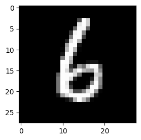
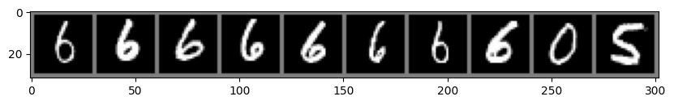
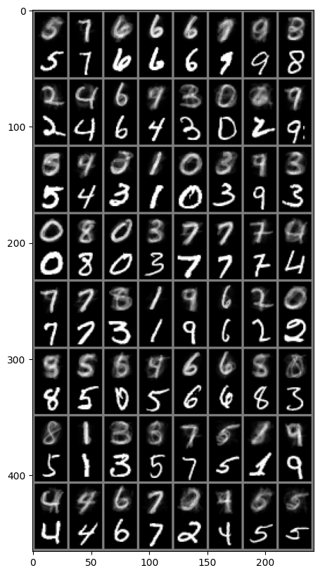

# Attention Basics

Learning attention mechanism from scratch by.
- Attention from scratch
- Multi-head attention
- Pytorch implementation of Multi-head attention
- Using multi-head attention to rank images that are closest to origin image by attention


## Usage

Work with the notebooks by creating a virtual environment and use the `requirements.txt` to setup the packages.

To train the attention model `train_mha.ipynb`, use Google Colab, and enable GPU:


<a target="_blank" href="https://colab.research.google.com/github/https://colab.research.google.com/github/KjetilIN/attention-basics/blob/main/notebooks/train_mha.ipynb">
  
</a>


## Results of trained MNIST model 

After training we can use the following image as a Query (Q): <br>


Then the 10 closest images in by attention value becomes: <br>


See also some pairs after training: <br>



## Resources

"Attention is all you need" paper: <br>

```bibtex
@misc{vaswani2023attentionneed,
    title={Attention Is All You Need}, 
    author={Ashish Vaswani and Noam Shazeer and Niki Parmar and Jakob Uszkoreit and Llion Jones and Aidan N. Gomez and Lukasz Kaiser and Illia Polosukhin},
    year={2023},
    eprint={1706.03762},
    archivePrefix={arXiv},
    primaryClass={cs.CL},
    url={https://arxiv.org/abs/1706.03762}, 
}
```


Pytorch help from Luke Ditria: <br>
https://github.com/LukeDitria/pytorch_tutorials 